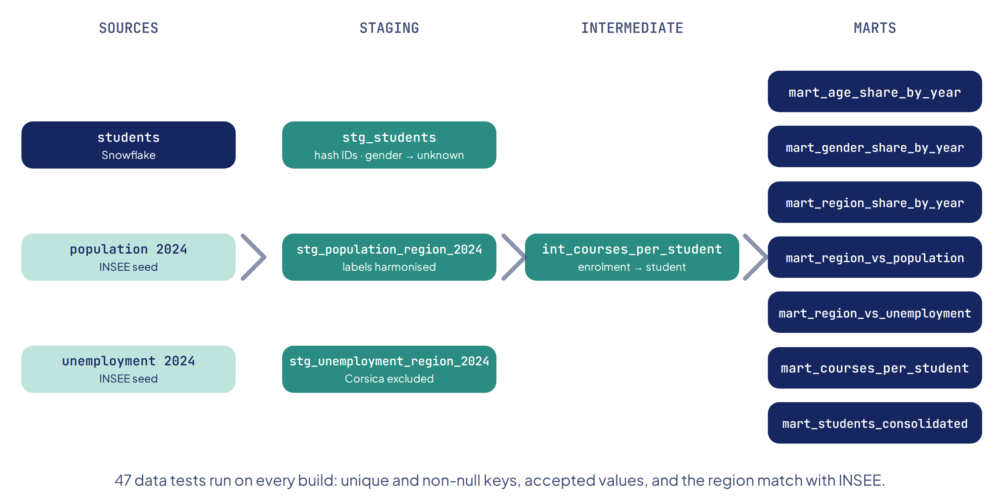

# Who still enrols in the Data path?

A dbt and Snowflake pipeline that cleans, pseudonymises and enriches four years of OpenClassrooms enrolments with INSEE data, then reads how the student profile is changing.

**Full case study:** [axeldrtdata.github.io/works/student-demographics-dbt](https://axeldrtdata.github.io/works/student-demographics-dbt/)

## Context

OpenClassrooms wanted to understand how the profile of the students enrolling in its Data Analyst path (age, gender, region) changed between 2022 and 2025. The internal data needed a reliable, documented and reproducible transformation that respects the GDPR, enriched with public INSEE data to compare students with the French population.

## The pipeline



| Layer | Role | Models |
| ----- | ---- | ------ |
| **Sources and seeds** | Raw enrolments in Snowflake; INSEE population and unemployment as seeds | `students`, `population_region_2024`, `unemployment_region_2024` |
| **Staging** | One model per source: pseudonymise identifiers, make missing genders explicit, harmonise region labels | `stg_students`, `stg_population_region_2024`, `stg_unemployment_region_2024` |
| **Intermediate** | Business logic: from the enrolment grain to the student grain | `int_courses_per_student` |
| **Marts** | Analysis-ready tables | shares by year (age, gender, region), region vs population, region vs unemployment, courses per student, consolidated dataset |

**GDPR**: student identifiers are hashed with SHA-256 in the first layer and never exposed downstream. This is pseudonymisation, not anonymisation. The raw enrolment file is not published in this repository.

**Data quality**: 47 data tests run on every build: unique and non-null keys, accepted values (gender, age group, year, category) and a relationship test checking that every student region exists in the INSEE reference. The full build passes 60 checks out of 60.

## Key results

| Indicator | Result |
| --------- | ------ |
| Enrolments | 1,696 in 2022, 850 in 2024, 951 in 2025 (−44%) |
| Under-35s | 43% of enrolments in 2022, 53% in 2025 |
| Women (among students who gave their gender) | about 30% every year, 18% among 20–24-year-olds |
| Gender not given | 42% in 2022, 7% in 2025 |
| Île-de-France | 45% of students for 18% of the population (ratio 2.47) |
| Re-enrolment | 14% of students follow more than one path |

## Repository structure

```
student-demographics-dbt/
├── dbt_project.yml
├── profiles.example.yml          # Snowflake profile template (+ optional local DuckDB target)
├── macros/
│   └── hash_id.sql               # SHA-256 hashing, works on Snowflake and DuckDB
├── models/
│   ├── _models.yml               # documentation and tests for every model
│   ├── staging/
│   ├── intermediate/
│   └── marts/
├── seeds/                        # INSEE reference data (population, unemployment)
├── data/
│   └── consolidated_dataset.csv  # final pseudonymised dataset
└── docs/
    └── pipeline.png
```

## How to run it

```bash
pip install dbt-snowflake
cp profiles.example.yml ~/.dbt/profiles.yml   # then fill in your credentials
dbt seed
dbt build
```

`dbt build` rebuilds the whole chain, from sources to marts, and runs every test.

## Limitations

- The causes of the decline in enrolments are not in the data.
- The completeness of 2025 remains to be confirmed.
- Several regions have small numbers, so regional gaps are not interpretable one by one.
- INSEE does not publish a full-year unemployment rate for the overseas regions.
- One INSEE year (2024) is used for the whole period; regional population shares move by less than 0.1 point between 2022 and 2025.

## Stack

SQL · dbt · Snowflake · Git

## Data sources

Internal OpenClassrooms enrolments (not published). INSEE: [regional population 2024](https://www.insee.fr/fr/statistiques/8721456) and [regional unemployment 2024](https://www.insee.fr/fr/statistiques/8376844?sommaire=8376908).

## Note

The project was first built in French during my OpenClassrooms Data Analyst training. Model names, column names and documentation have since been translated into English; category values such as age groups ("30-34 ans") are kept as in the source data.

---

Axel Derobert · Data Analyst · [Portfolio](https://axeldrtdata.github.io) · [LinkedIn](https://www.linkedin.com/in/axel-derobert-5717463b1/)
